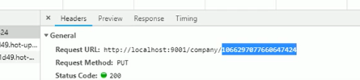
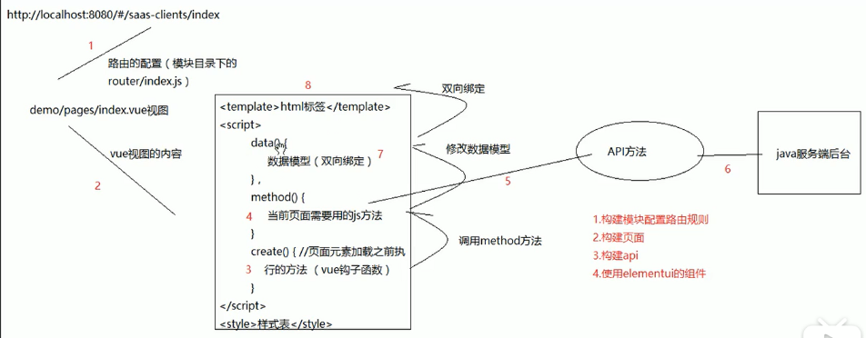
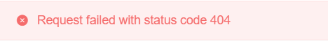

# 2.21
1.  为什么要BaseController 和 BaseService 
2.  common 和 company 都要JPA 可以直接 放在父类吗
3.  前端 中的 model 是功能模块
4.   
    纠错 可以由header查看 路径
## 1.JPA 和 Django 的理解
## 2.JPA 和 tkMapper
|  区别        | JPA           | tkMapper           |
|  ----         | ----             |----              |
| 承载类        | 注解          |              |
| 三层架构      | 不需要           |代码生成器 大量文件               |
## 3.前后端联动

    SpringBoot启动类 发送数据 VSCode 接收
1.  1
2.  流程：
    1.  复制张贴model
    2.  注册main.js 固定写法
    3.  编写api
    4.  config-dev指定前缀
***     ***     ***     ***     ***
|  区别        | VUE           | SpringBoot           |
|  ----         | ----             |----              |
| 视图引擎        | {{a.b}}          |Thymeleaf             |
| 前端      | .vue           |html              |
| 传递后台数据      | api          |  {{ }}              |
|      |           |              |
## 问题
1.Nginx 闪退问题：

    放在 无中文目录下 即可
2.
    
    先从controller找 1/0

# 2.22
1.  

    1.  前端VUE代理 :
    2.  请求后缀拼接、挂载
2.  一些特殊类是干什么的：
3.  
    Map 和 @RequestBody
*****************************************************
## JWT流程
1.  导包
## 问题
1.
    
    
    没启动 Company 启动类
2.

    VUE 请求了后台数据 但没有收到
    ——》 后台数据没处理好
    ——》